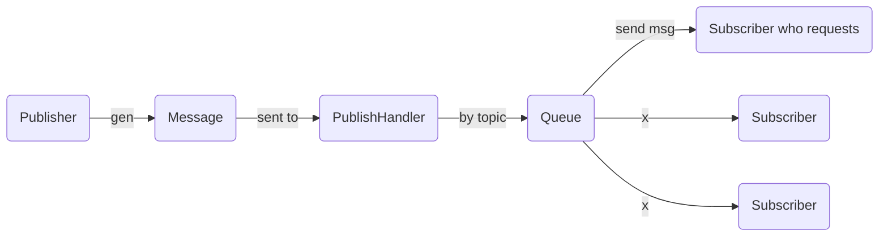
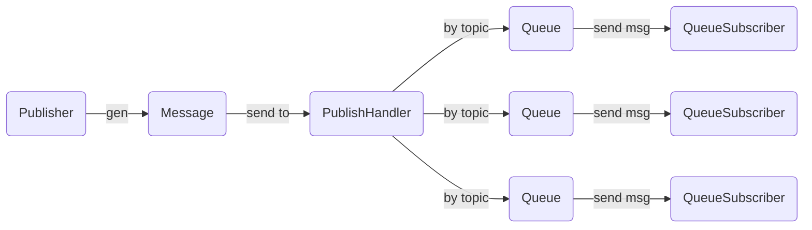
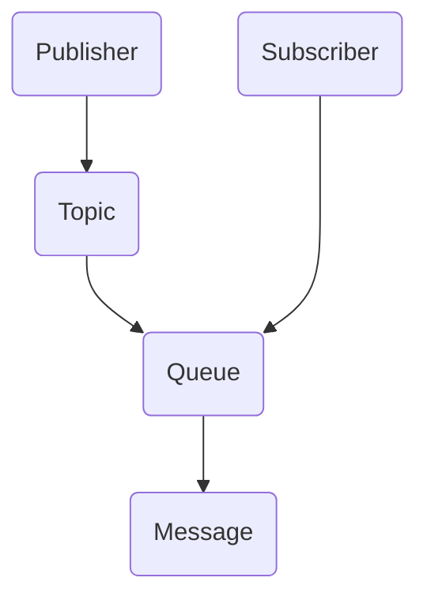

# Feature

* GRPC
* Persistance
* Signle & Fanout
* Auto create topic

# Design

## Subscribe mode

* Single

* Fanout

## Entity

### Broker

### IDManager

### SubscriberIndex

queue id or subscriber host index by queue

### Publisher(cli)

Send message created by client to broker that will verify message validation.

* funcs
  1. connect to broker
  2. send message to broker

### Messsage

Data carrier. Will be distributed by handler with topic type and topic. And it also will be stored in queue and wait for subscriber's pull.

* funcs
  1. ~~new message~~
  2. ~~duplicate itself~~
  3. ~~mark id~~

### Topic

* funcs
  1. ~~new topic~~
  2. ~~bind queue(s)~~
  3. ~~distribute message into queue(s)~~

### Queue

* funcs
  1. ~~new queue(s)~~
  2. ~~push message into queue~~
  3. ~~bind subscriber~~
  4. offer subscriber message

### Subscriber(cli)

Should be registered in broker and claim topics.

* funcs:
  1. Send register request
  2. Connect to broker and be ready for pull (keep alive)
  3. pull message

### PublishHandler

* funcs:
  1. ~~Get message request~~
  2. ~~Get queue(s) by message topic~~
     1. ~~if there is no topic, create one~~
     2. ~~if there is no queue, create one~~
  3. ~~Push message in queue(s)~~

### SubscribeHandler

* funcs

  1.
  2. Handle subscriber's register
  3. Wait for client's pull
  4. Maintain relationship between queue and subscriber
  5. Response message when subscriber request

### StrIDMap

id generator should be persisted
